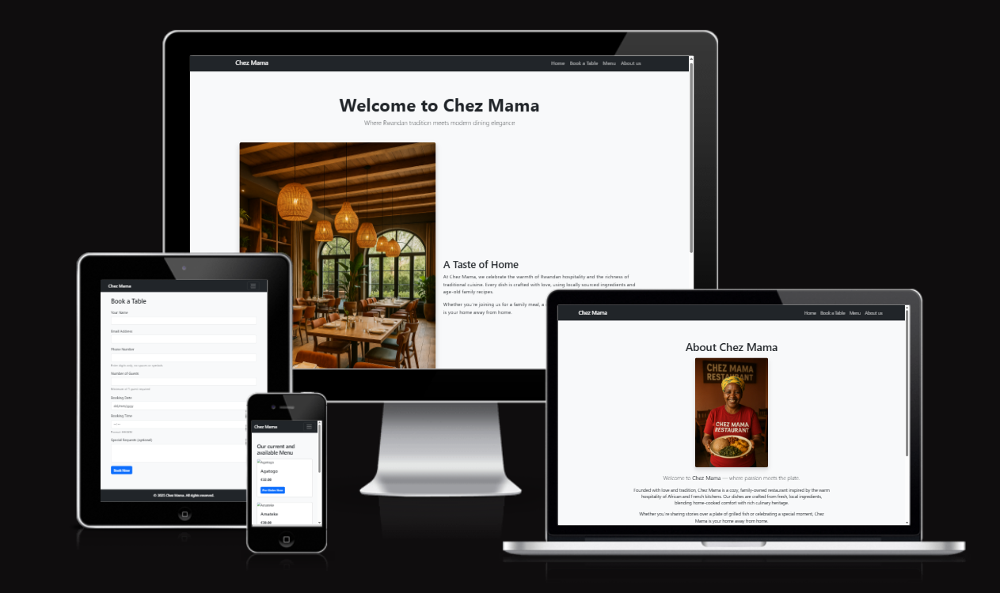

# 🍽️ Chez Mama Restaurant Booking App

- [Live Appliction](https://restaurant-booking-vital-83aa0e106c92.herokuapp.com/)
---

## 🏠 Overview

**Chez Mama** is a full-featured Django web application for managing restaurant bookings, designed to celebrate traditional **Rwandan cuisine** and enhance the dining experience through technology.  

Visitors can:  
- 📜 Browse our delicious menu (with images and pagination)  
- 🍽️ Book a table online and optionally choose a dish in advance  
- 📧 Receive confirmation emails automatically  
- ❌ Cancel a booking with one click  

---
## 🎯 Purpose

This application helps small and medium-sized restaurants:
- Accept and manage **online reservations**
- Prevent **double-bookings** through automated availability checks
- Display an **interactive, image-rich menu**
- Store and serve media securely via **Cloudinary**
- Manage **customer feedback and cancellations**
- Keep clients engaged through **email notifications**
- Showcase **reviews and Rwandan dishes** to global visitors

---

## 🚀 Features

- 📋 **Menu listing** – Dishes stored in the database with images and availability  
- 🍽️ **Booking system** – Users can reserve a table based on number of guests  
- 🧑‍🤝‍🧑 **Automatic table allocation** – Matches group size to available tables  
- ❌ **Cancel booking option** – Simple public cancellation form  
- 🔐 **User authentication** – Register, login, and manage personal bookings  
- 🛠️ **Admin panel** – Manage menu items, bookings, and feedback  
- 🌄 **Cloudinary image uploads** for menu items  
- ✉️ **Email confirmations** via SMTP or console backend  
- 📱 **Responsive Bootstrap UI**  
- 🔄 **Real-time table availability preview**  
- 📑 **Pagination** for menus and feedback lists  

---

## 🔐 User Authentication & CRUD Functionality

The application includes a **complete authentication system** and full CRUD features:

| CRUD Action | Description | Access Control |
|--------------|-------------|----------------|
| **Create** | Users can create new bookings via the booking form | Logged-in users & public visitors |
| **Read** | Users view their own bookings under **My Bookings** | Logged-in users |
| **Update** | Users can edit existing bookings | Only booking owner |
| **Delete** | Users can cancel or delete bookings | Only booking owner |

🛡 **Defensive Design**
- Unauthorized users cannot access `/my-bookings/` or modify others’ bookings.  
- Direct URL access to another user’s booking redirects or denies access.  
- Forms validate dates, guest numbers, and phone numbers with server-side checks.

---

## 🧠 Technologies Used

- 🐍 **Python 3.12**  
- ⚙️ **Django 5.2.1**  
- 🗄️ **PostgreSQL** (production) / **SQLite** (development)  
- 🎨 **HTML5 / CSS3 / Bootstrap 5.3**  
- ☁️ **Cloudinary** – for media hosting  
- 📦 **Whitenoise** – static file serving  
- 🔑 **python-decouple** – secure environment variable management  
- 📨 **SMTP / Console Email Backend**

---
## 🎨 Design

The visual design of Chez Mama is intentionally warm and culturally grounded:
- Color accents are inspired by Rwandan aesthetics (earth tones, greens, warm yellows).
- Layout is mobile-first using Bootstrap 5.3.
- Content is organized into clear sections: hero area, menu cards with images, call-to-action buttons for booking.

### Wireframes
Initial wireframes were created for:
- Home page

    
- Book a Table page

    
- Menu page

    

- About us page

    

- "My Bookings" dashboard

    

These wireframes guided layout decisions such as:
- Top navigation bar with clear calls to action (Book a Table, Menu, Contact)
- Card-based menu items with image + description
- A focused booking form with only essential inputs


---
## 🧭 Quick Links

| Document | Description |
|-----------|-------------|
| [🧪 TESTING.md](./TESTING.md) | Full record of all testing (manual, automated, and validation checks). |
| [✅ VALIDATION.md](./VALIDATION.md) | Evidence of HTML, CSS, Python (PEP8), and Lighthouse validation. |
| [🚀 DEPLOYMENT.md](./DEPLOYMENT.md) | Step-by-step instructions for deploying locally and to Heroku. |
| [🙏 CREDITS.md](./CREDITS.md) | References, acknowledgments, and image attributions. |

---

## 🏁 Deployment Summary

- Hosted on **Heroku** using **Gunicorn**.  
- Static assets served by **Whitenoise**.  
- Media assets hosted by **Cloudinary**.  
- PostgreSQL database configured via **dj-database-url**.
| [🚀 DEPLOYMENT.md](./DEPLOYMENT.md) | Step-by-step instructions for deploying locally and to Heroku. |


---


## 📸 Traditional Dishes Showcased

The menu celebrates Rwandan culture with authentic dishes:

| Dish    | Emoji | Description                      |
| ------- | ----- | -------------------------------- |
| Isombe  | 🥬    | Cassava leaves with peanut sauce |
| Akabenz | 🐖    | Crispy fried pork                |
| Ubugali | 🍚    | Cassava or maize meal            |
| Ibihaza | 🎃    | Pumpkin dish                     |
| Melange | 🍲    | Mixed street dish                |
| Ibirayi | 🍟    | Fried potatoes                   |

Images are stored and served via Cloudinary with pagination for smooth browsing.

---

## 📧 Email Notifications

▫️Upon booking, a confirmation email is sent automatically.

▫️Includes customer details, date/time, and special requests.

▫️In development, Django prints emails to the console.

▫️In production, it uses SMTP via Gmail or another provider.

▫️Cancellation emails and links are supported for easy booking management.

---

## 🗂 Project Structure

```bash
restaurant_booking/
│
├── bookings/              # Main app
│   ├── migrations/
│   ├── models.py
│   ├── views.py
│   ├── urls.py
│   └── templates/bookings/
│
├── media/                 # Dish images
├── static/                # CSS, JS, images
├── .env                   # Environment secrets (not committed)
├── Procfile
├── requirements.txt
└── manage.py
```

---
## 🧩 Agile Development Approach

The project followed Agile methodology with iterative sprints and continuous feedback:

🗓 Short sprints delivering working features

🗂 User stories representing real customer/admin workflows

🔁 Continuous testing & iteration for improvements

📊 Backlog management for bug fixes and new features

⚡ Adaptive planning based on stakeholder feedback


---


## 🚀 Planned Future Enhancements

Here are upcoming improvements and features planned for the next version of the app:

📨 Send cancellation confirmation emails

🌐 Add multilingual support (EN/FR)

🔐 Add role-based admin permissions

🗓️ Calendar view for admin bookings

📅 Define restaurant opening hours (currently 24/7 assumed)

🗺️ Add map integration

💳 Enable online ordering & payment

🥘 Add official Chez Mama logo

Stay tuned and watch the GitHub repo for upcoming milestones and issues.

---

## 🐞 Known Bugs

| Issue                            | Description                             |
| -------------------------------- | --------------------------------------- |
| 🖼️ Admin image preview          | Requires refresh to show uploaded image |
| 🕐 Double booking race condition | Rare if two users submit simultaneously |
| 📧 Cancellation email            | Not implemented yet                     |
| 📆 Date/time picker              | Mobile browser inconsistencies          |
| 📱 Menu layout                   | Overlaps on very narrow screens         |


---


## 🌍 Want to Help or Share Ideas?

You can reach out to the admin team with suggestions, traditional dish ideas, or feedback. We’d love to improve the experience!

Thank you for visiting our restaurant site – enjoy your meal! 🇷🇼🍛

---
## 🙋 Contributing

Contributions are welcome! Please fork the repository, create a new branch, and open a pull request with your improvements or fixes.

---


## 🙏 Credits & Acknowledgments

| [🙏 CREDITS.md](./CREDITS.md) | References, acknowledgments, and image attributions. |

##💡 Summary

✅ Full CRUD and Authentication
✅ Responsive Bootstrap UI
✅ Email + Cloudinary Integration
✅ Deployed on Heroku with PostgreSQL
✅ Cultural storytelling through traditional dishes

Enjoy your virtual meal at Chez Mama! 🍛