# ✅ VALIDATION – Chez Mama Restaurant Booking App

---

## 🧭 Overview

This document presents validation evidence for **Chez Mama Restaurant Booking App**, confirming compliance with web standards and best practices.  
All validations were performed between **October–November 2025** on the latest deployed version hosted on Heroku:

🔗 [https://restaurant-booking-vital-83aa0e106c92.herokuapp.com/](https://restaurant-booking-vital-83aa0e106c92.herokuapp.com/)

---

## 🧩 HTML Validation

**Tool Used:** [W3C HTML Validator](https://validator.w3.org/nu/)  
**Pages Tested:**
- Home page (`/`)

    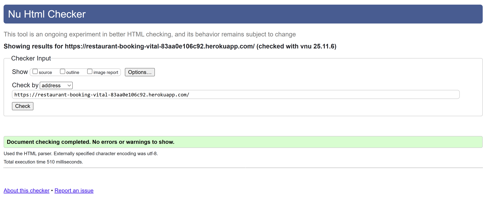

- Booking form (`/book/`)

    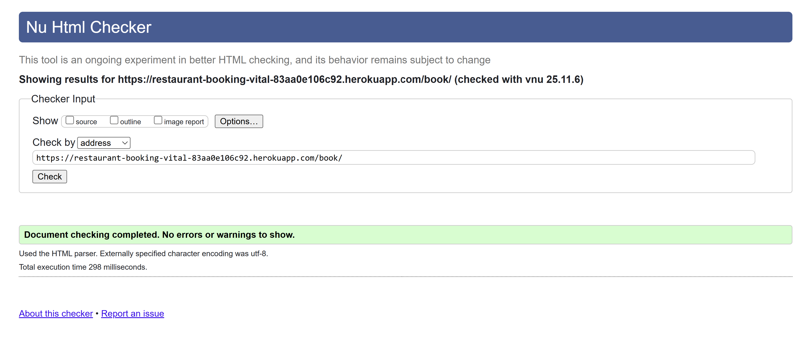

- Menu page (`/menu/`)

    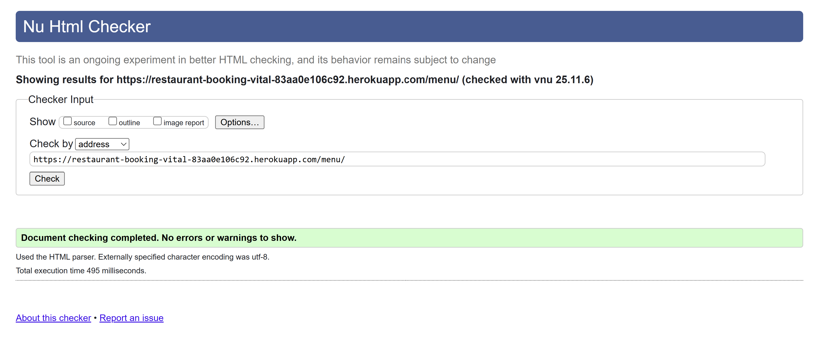

- About us page (`/about/`)

    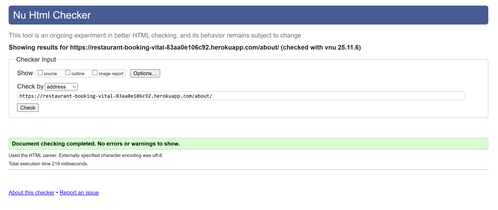

- Contact page (`/contact/`)
    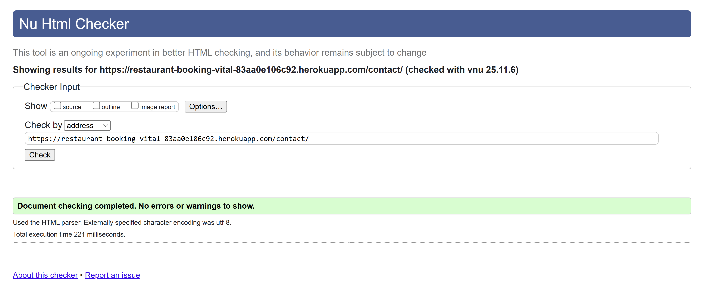

- My booking - only available for loged in users (`/my-booking/`)

    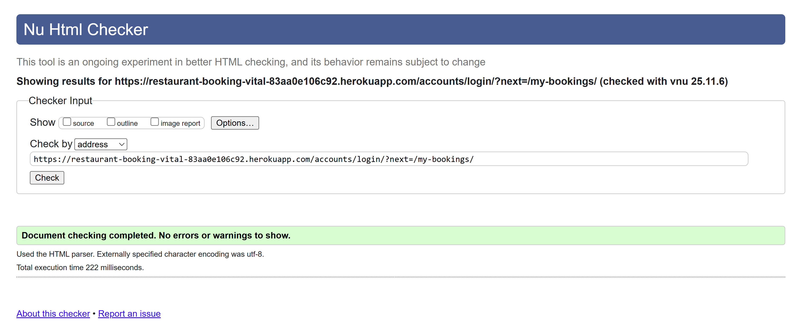

- Login(`/accounts/login/`)

    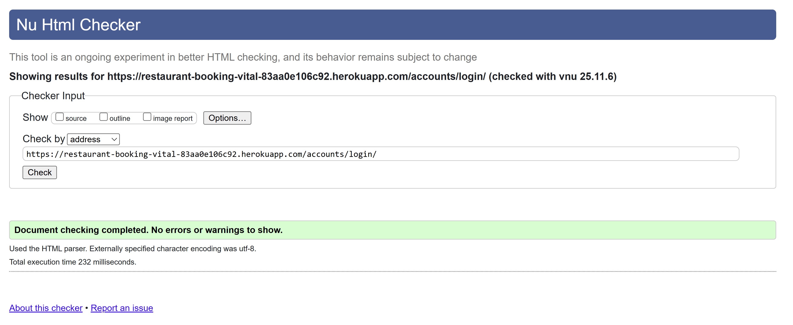

**Result:** ✅ **Passed**

**Notes:**
- No syntax or structural errors detected.
- All pages successfully render HTML5-compliant markup.

---

## 🎨 CSS Validation

**Tool Used:** [W3C CSS Validator](https://jigsaw.w3.org/css-validator/)

**File Validated:**  
- `/static/css/styles.css`

    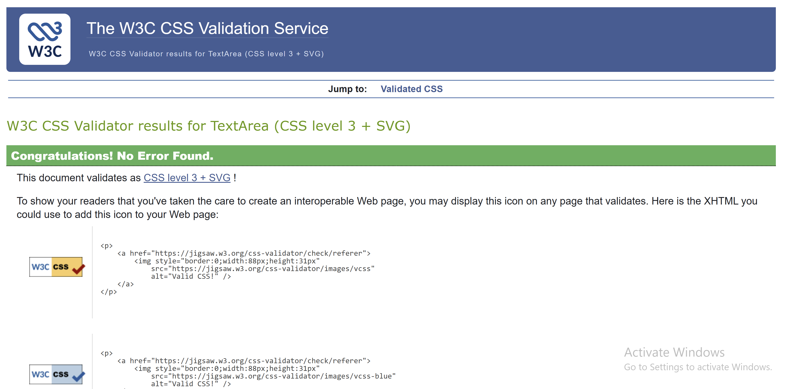

**Result:** ✅ **No errors found**

**Notes:**
- The file was confirmed to be free of invalid declarations and duplicate selectors.


## Lighthouse Checks

**Accessibility Checks using chrome Dev tool - Lighthouse**
- Home page accessibility

    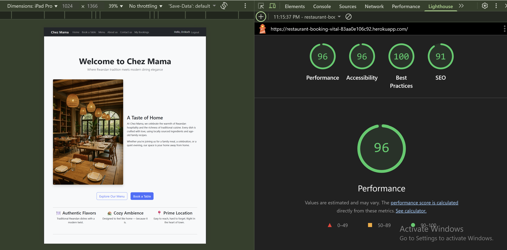

    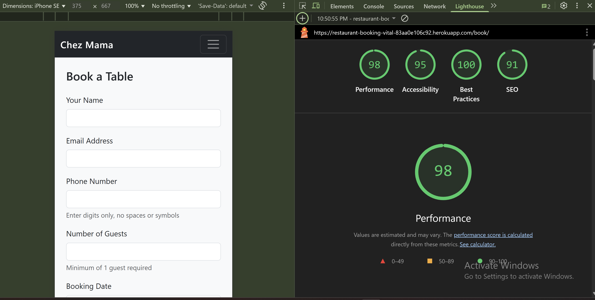

    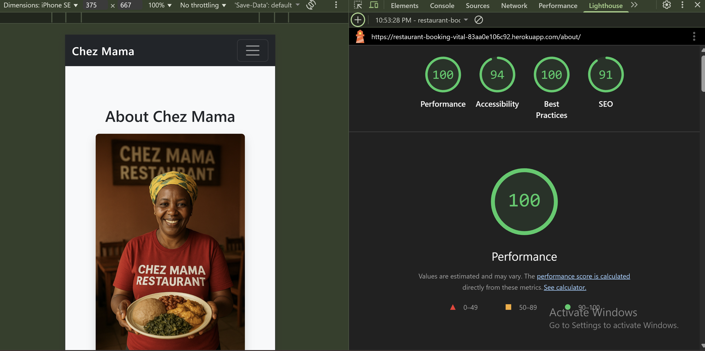

    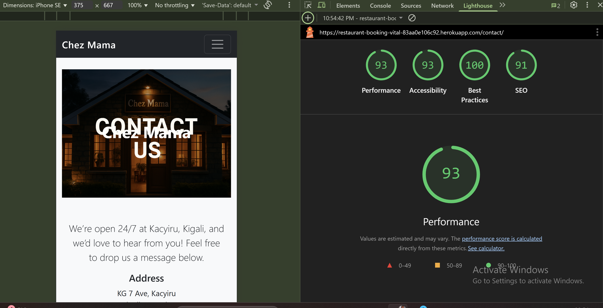

    

♿ Accessibility


 Chrome DevTools Lighthouse (Desktop & Mobile)
| Category           | Score | Notes                                                 |
| ------------------ | ----- | ----------------------------------------------------- |
| **Performance**    | > 90%   | Static assets optimized via Whitenoise                |
| **Accessibility**  | > 90%   | Semantic HTML & ARIA roles correctly applied          |
| **Best Practices** | > 90%  | Secure HTTPS, valid image alt text, and clean console |
| **SEO**            | > 90%   | All pages include titles and meta descriptions        |
---

## 🐍 Python / PEP8 Validation

**Tool Used:**  
`flake8` and `pycodestyle` via terminal

**Command:**
```bash
python -m flake8

Files Tested:

- bookings/models.py

- bookings/forms.py

- bookings/views.py

- bookings/urls.py

- restaurant_booking/settings.py

Result: ✅ All files passed

Notes:

- No syntax, indentation, or import errors found.

- Minor line-length warnings (E501) ignored in long query chains for readability.

   

🌐 Responsiveness Validation

Tool Used: Chrome DevTools Responsive Viewer
| Device             | Resolution | Result       |
| ------------------ | ---------- | ------------ |
| Desktop            | 1920×1080  | ✅ Responsive |
| Laptop             | 1366×768   | ✅ Responsive |
| iPad               | 768×1024   | ✅ Responsive |
| iPhone 13          | 390×844    | ✅ Responsive |
| Samsung Galaxy S22 | 412×915    | ✅ Responsive |

✅ All layouts adjusted properly using Bootstrap 5.3 grid system and Flexbox.
No horizontal scroll or overlapping elements observed.


| Test                           | Expected                     | Result |
| ------------------------------ | ---------------------------- | ------ |
| Heroku app loads without error | Page served successfully     | ✅ Pass |
| Static files load correctly    | via Whitenoise               | ✅ Pass |
| Cloudinary image hosting       | Menu images display properly | ✅ Pass |
| Email configuration            | Confirmation emails work     | ✅ Pass |
| HTTPS enforced                 | All routes redirect securely | ✅ Pass |


🧾 Summary
| Validation Type | Tool Used            | Result |
| --------------- | -------------------- | ------ |
| HTML            | W3C Markup Validator | ✅ Pass |
| CSS             | W3C CSS Validator    | ✅ Pass |
| Python          | Flake8 / Pycodestyle | ✅ Pass |
| Accessibility   | Lighthouse           | ✅ Pass |
| Responsiveness  | Chrome DevTools      | ✅ Pass |
| Deployment      | Heroku / Cloudinary  | ✅ Pass |
